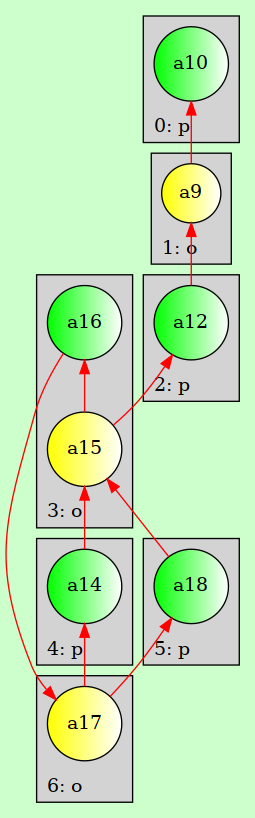
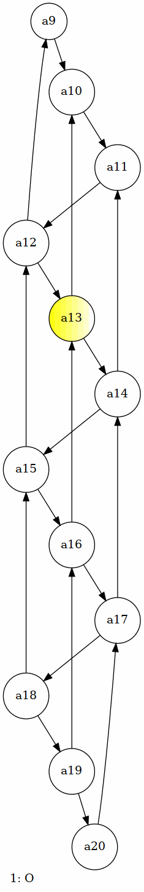
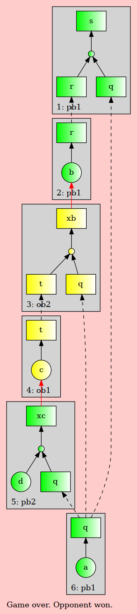
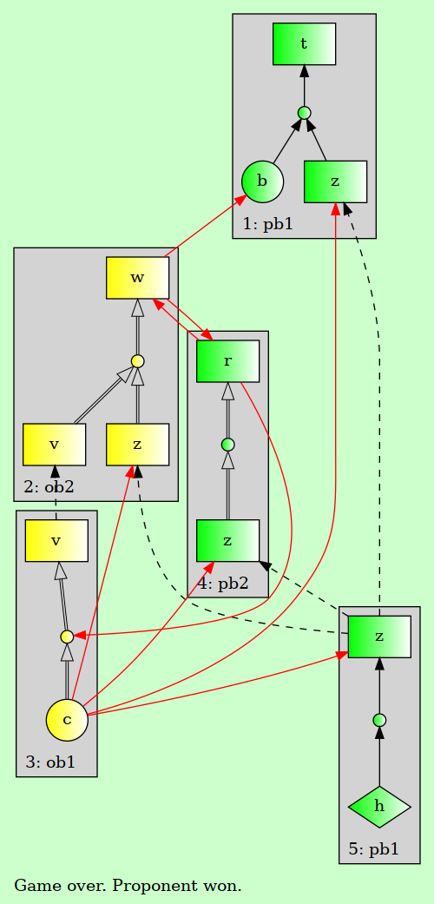

```
███╗   ███╗███████╗      ██████╗ ██╗███████╗
████╗ ████║██╔════╝      ██╔══██╗██║██╔════╝
██╔████╔██║███████╗█████╗██║  ██║██║███████╗
██║╚██╔╝██║╚════██║╚════╝██║  ██║██║╚════██║
██║ ╚═╝ ██║███████║      ██████╔╝██║███████║
╚═╝     ╚═╝╚══════╝      ╚═════╝ ╚═╝╚══════╝
                                            
```

## Installation
[clingo](https://potassco.org/clingo/python-api/5.4/) python module is required. It can be installed via conda:

```
conda env create -f environment.yml
conda activate clingo-env
```


## Run
### ABA:
under admissible semantics, with instance `<INSTANCE>` and goal `<GOAL>`, run: 
```
python msdis.py -f aba -p <INSTANCE> -b "g(<GOAL>). tt(ta). at(dabf)." 
```

for example:

```
python msdis.py -f aba -p test-instances/aba-test-instance.lp -b "g(a4). tt(ta). at(dabf)." 
```

For stable semantics, set `tt(ts). at(ts).` as below:
```
python msdis.py -f aba -p test-instances/aba-test-instance.lp -b "g(a4). tt(ts). at(dc)." 
```

### AF:
```
python msdis.py -f af -p test-instances/af-test-instance.lp -b "g(36)."

```

### ASPIC:
```
python msdis.py -f aspic -p test-instances/aspic-test-instance.lp -b "g(t)."
```


## Interactive mode:
Provide the `-i` flag, e.g.:
```
python msdis.py -f aba -p test-instances/aba-test-instance.lp -i -b "g(a4). tt(ta). at(dabf)." 
```

Provide the `-i` flag, e.g.:
```
python msdis.py -f aba -p test-instances/paper-running-example-aba.lp -i -b "g(s). tt(ta). at(dabf)." 
```

## Approximate reasoning
Provide the horizon (upper bound on the number of moves) with `-x <HORIZON>` e.g. 
```
python msdis.py -f aba -p test-instances/aba-test-instance.lp -b "g(a4). tt(ta). at(dabf)." -x 15
```

## Visualisation

Provide a visualisation clingraph encoding with a `-v <ENCODING>` parameter, e.g.:

<!--  -->

<!-- ### AF encoding 1  
`python msdis.py -f af -p test-instances/af-ex2.lp -i -b "g(a10)." -v encoding/af/af-vis1.lp`  


### AF encoding 2
`python msdis.py -f af -p test-instances/af-ex2.lp -i -b "g(a10)." -v encoding/af/af-vis2.lp`  


### ABA
`python msdis.py -f aba -p test-instances/paper-running-example-aba.lp -b "g(s)." -i -v encoding/aba/aba-vis.lp`  


### ASPIC
`python msdis.py -f aspic -p test-instances/aspic-test-instance.lp -i -b "g(t)." -v encoding/aspic/aspic-vis.lp`
 -->


| Encoding     | Command example                                                                                      | Screenshot                       |
|--------------|----------------------------------------------------------------------------------------------------|--------------------------------|
| AF encoding 1| `python msdis.py -f af -p test-instances/af-ex2.lp -i -b "g(a10)." -v encoding/af/af-vis1.lp`       |   |
| AF encoding 2| `python msdis.py -f af -p test-instances/af-ex2.lp -i -b "g(a10)." -v encoding/af/af-vis2.lp`       |   |
| ABA          | `python msdis.py -f aba -p test-instances/paper-running-example-aba.lp -b "g(s)." -i -v encoding/aba/aba-vis.lp` |            |
| ASPIC+       | `python msdis.py -f aspic -p test-instances/aspic-test-instance.lp -i -b "g(t)." -v encoding/aspic/aspic-vis.lp` |         |
